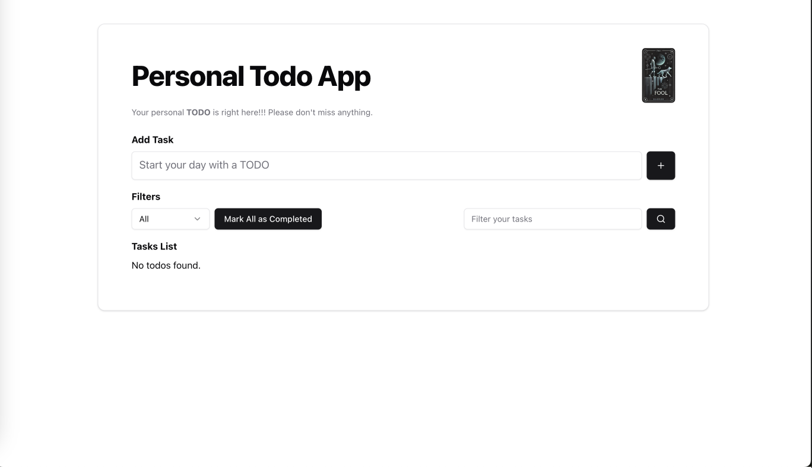

# Todo App 

This project is a React + TypeScript application powered by Vite, providing fast development with Hot Module Replacement (HMR) and a minimal setup. The app includes a sample todo application and integrates ESLint for consistent code quality.

## Features

- **React + TypeScript**: Combines the power of React with type safety.
- **Vite**: Lightning-fast development environment with HMR.
- **ESLint**: Enforces best practices and coding standards.
- **Redux**: For state management in the todo app.

---

## Installation

Follow these steps to set up the project on your local machine.

### Using Yarn

```bash
# Clone the repository
git clone https://github.com/yourusername/react-redux-todoapp.git

# Navigate into the project directory
cd react-redux-todoapp

# Install dependencies
yarn

# Start the development server
yarn dev
```

### Using NPM

```bash
# Clone the repository
git clone https://github.com/yourusername/react-redux-todoapp.git

# Navigate into the project directory
cd react-redux-todoapp

# Install dependencies
npm install

# Start the development server
npm run dev
```

---

## Demonstration

### 1. Todo App Dashboard
*The main and only feature of the app :v*




---

